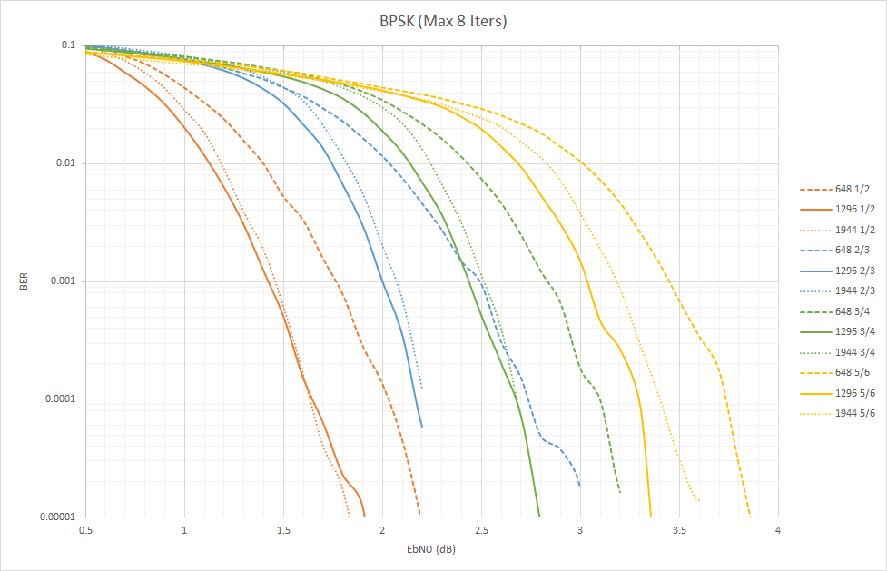

# wlan_ldpc
Reference implementation of an encoder/decoder for WLAN LDPC codes.

* Written in C++ with example usage an QtCreator project file.
* Encoding and decoding.
* Decoding 
  * Soft decision
  * Offset minsum approximation
  * Layered
  * Early termination 
  * Floating point
* Supports all 12 base matrices defined in Annex F in IEEE 802.11-2016.
* Does not provide shortening, puncturing, or repeat bit functionality.
* Compiled on Windows with the VS2012 x64 compiler.

Simulated performance

Measured Throughput
| Block Size | Decoding - 8 iters - Message bits (Mb/s) |
| 648 | 1.65 |
| 1296 | 1.84 |
| 1944 | 2 |

References
* LDPC and Polar Codes in 5G Standard, NPTEL-NOC_IITM, https://www.youtube.com/playlist?list=PLyqSpQzTE6M81HJ26ZaNv0V3ROBrcv-Kc
* IEEE Std 802.11-2016, https://standards.ieee.org/standard/802_11-2016.html

